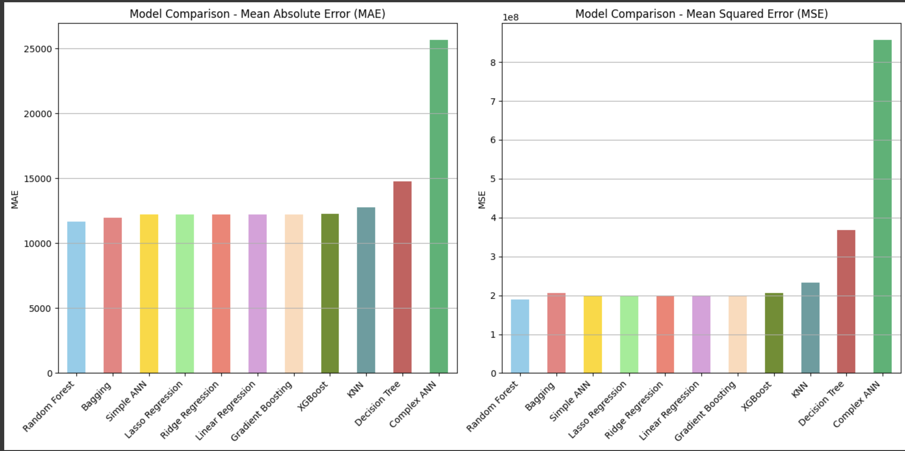

# Capstone__UCB_ML_HealthCare
### *Final Capstone Project HealthCare , UC Berkeley ML Course 2025*

### Project Title
Capstone Project: HealthCare Billing Amount Prediction 

**Author**
John Kowalkowski , MBA 

#### Executive summary

#### Rationale
Why should anyone care about this question?

This project will predict the hospital billing using patient and admission data from the "HealthCare_Dataset.csv" found on Kaggle.com. The output will achieve accurate cost forecasts to in an effort to optimze hospital resource planning and insurance negetiations. These forecasts could potentially reduce financial overhead by 15-20% based on industry benchmarks today.

### BenchMark Reference: [Article1](https://www.chiefhealthcareexecutive.com/view/hospital-financial-woes-lagging-volume-more-claim-denials-and-debt-concerns), [Article2](https://www.oliverwyman.com/our-expertise/perspectives/health/2024/april/5-ways-hospitals-can-cut-costs-achieve-long-term-stability.html#:~:text=The%20aggregate%20impact%20of%20these,of%20the%20care%20delivery%20chassis.)

#### Research Question
What are you trying to answer?

Research Question: How can patient profiles and admission details be used to accurately predict hospital billing amounts to optimize resource allocation and insurance negotiations?

This project will focus on predicting the hospital billing by using patient and admission data from the "HealthCare_Dataset.csv" found on Kaggle.com. The output will achieve accurate cost forecasts in an effort to optimze hospital resource planning and insurance negetiations. These forecasts could potentially reduce financial overhead by 15-20% based on industry benchmarks today.

#### Data Sources
What data will you use to answer you question?
[HealthCare Dataset](https://www.kaggle.com/datasets/prasad22/healthcare-dataset) provided by Kaggle. 

About Dataset
Context:
This synthetic healthcare dataset has been created to serve as a valuable resource for data science, machine learning, and data analysis enthusiasts. It is designed to mimic real-world healthcare data, enabling users to practice, develop, and showcase their data manipulation and analysis skills in the context of the healthcare industry.

Inspiration:
The inspiration behind this dataset is rooted in the need for practical and diverse healthcare data for educational and research purposes. Healthcare data is often sensitive and subject to privacy regulations, making it challenging to access for learning and experimentation. To address this gap, I have leveraged Python's Faker library to generate a dataset that mirrors the structure and attributes commonly found in healthcare records. By providing this synthetic data, I hope to foster innovation, learning, and knowledge sharing in the healthcare analytics domain.

Dataset Information:
Each column provides specific information about the patient, their admission, and the healthcare services provided, making this dataset suitable for various data analysis and modeling tasks in the healthcare domain. Here's a brief explanation of each column in the dataset -

Name: This column represents the name of the patient associated with the healthcare record.
Age: The age of the patient at the time of admission, expressed in years.
Gender: Indicates the gender of the patient, either "Male" or "Female."
Blood Type: The patient's blood type, which can be one of the common blood types (e.g., "A+", "O-", etc.).
Medical Condition: This column specifies the primary medical condition or diagnosis associated with the patient, such as "Diabetes," "Hypertension," "Asthma," and more.
Date of Admission: The date on which the patient was admitted to the healthcare facility.
Doctor: The name of the doctor responsible for the patient's care during their admission.
Hospital: Identifies the healthcare facility or hospital where the patient was admitted.
Insurance Provider: This column indicates the patient's insurance provider, which can be one of several options, including "Aetna," "Blue Cross," "Cigna," "UnitedHealthcare," and "Medicare."
Billing Amount: The amount of money billed for the patient's healthcare services during their admission. This is expressed as a floating-point number.
Room Number: The room number where the patient was accommodated during their admission.
Admission Type: Specifies the type of admission, which can be "Emergency," "Elective," or "Urgent," reflecting the circumstances of the admission.
Discharge Date: The date on which the patient was discharged from the healthcare facility, based on the admission date and a random number of days within a realistic range.
Medication: Identifies a medication prescribed or administered to the patient during their admission. Examples include "Aspirin," "Ibuprofen," "Penicillin," "Paracetamol," and "Lipitor."
Test Results: Describes the results of a medical test conducted during the patient's admission. Possible values include "Normal," "Abnormal," or "Inconclusive," indicating the outcome of the test.

#### Methodology
What methods are you using to answer the question?

## Methodology

The analysis followed a standard CRISP-DM framework, giving the following stages:

1.  **Data Acquisition and Initial Assessment:**
    *   The dataset was loaded into a pandas DataFrame for initial inspection.

2.  **Exploratory Data Analysis (EDA):**
    *   Comprehensive data profiling was conducted using `df.info()` and visualizations (histograms, countplots, box plots, correlation heatmaps) to understand feature distributions, identify potential data quality issues, and explore relationships, particularly between predictor variables and the 'Billing Amount'.
    *   **Automated EDA was also performed using the `ydata-profiling` library to generate a detailed report on the dataset's characteristics.**

3.  **Feature Engineering:**
    *   A relevant feature, 'Length of Stay', was computed from the 'Date of Admission' and 'Discharge Date' columns.

4.  **Data Preprocessing and Cleaning:**
    *   High-cardinality features deemed less informative for prediction ('Name', 'Doctor', 'Hospital') were removed.
    *   Duplicate records were identified and dropped.
    *   Entries with non-positive 'Billing Amount' were excluded to align with the prediction objective.
    *   Textual inconsistencies in categorical features were addressed (e.g., lowercasing 'Medical Condition').
    *   Numerical feature ranges were validated.

5.  **Data Preparation for Modeling:**
    *   The dataset was partitioned into feature matrix (`X`) and target vector (`y`).
    *   Numerical and categorical feature subsets were defined.
    *   A train-test split (80/20 ratio with a fixed `random_state`) was performed to ensure unbiased model evaluation.
    *   Preprocessing pipelines were established: `StandardScaler` for numerical feature standardization and `OneHotEncoder` (with `drop='first'`) for categorical feature encoding.

6.  **Model Selection and Hyperparameter Optimization:**
    *   A suite of regression models was selected, including linear models (Linear Regression, Ridge, Lasso) and tree-based/ensemble methods (Decision Tree, KNN, Random Forest, Bagging, Gradient Boosting, XGBoost).
    *   OPTIONAL ANN : Simple and Complex Model Kera Tensor Flow
    *   Hyperparameter tuning was executed using `GridSearchCV` with 5-fold cross-validation, employing negative mean squared error as the scoring metric to identify optimal model configurations.

7.  **Model Training:**
    *   Each selected model was trained on the complete training dataset using its best-determined hyperparameters.

8.  **Model Evaluation and Analysis:**
    *   Model performance was assessed on the held-out test set using standard regression metrics: Mean Squared Error (MSE), Root Mean Squared Error (RMSE), and R-squared R2.
    *   Visual diagnostics, including Actual vs. Predicted and Residual plots, were generated for qualitative performance assessment and error pattern identification.
    *   Feature importance scores were analyzed for the ensemble tree-based models to identify the most influential predictors.

#### Results
What did your research find?

## Key Findings and Recommendations

Based on the conducted analysis and model evaluation:

*   Among the evaluated models, the **Bagging Regressor** and **Random Forest Regressor** demonstrated superior performance in terms of prediction accuracy on the test set, exhibiting the lowest MSE and RMSE values.
*   The overall predictive power of the models, as indicated by the R2scores, was relatively low across the board. This suggests that while the models can make predictions, they explain only a limited portion in the variety found in billing amounts based on the current feature set.
*   Feature importance analysis (Defined in the EXTRA steps) consistently highlighted **Room Number, Length of Stay, and Age** as the most significant predictors within the tree-based models, indicating their strong influence on billing amount predictions compared to the other features.

**Recommendation:** I recommended to prioritize the **Bagging Regressor** and **Random Forest Regressor** for deployment or further refinement due to their better predictive performance observed during evaluation. I would recommend utilizing both models could provide a more robust and reliable forecasting mechanism.

OPTIONAL ANN Analysis: Complex model was prone to overfitting and is not recommended. Despite performing better, the Simple model still performed poorly compared to both the Random Forest and Bagging. 

### Model Comparison

#### Next steps
**Areas for Future Step Exploration:**

To enhance the model's predictive capabilities and better address the project's objectives, consider the following:

*   **More Feature Engineering:** Investigate potential interaction terms or non-linear transformations of existing features identified as highly important.
*   **Integration of Additional Data Sources:** Explore adding other relevant patient or admissions data  like procedure codes, diagnosis severity scores, resource utilization
*   **Evaluation of Other Modeling Techniques:** Explore other regression algorithms or ensemble methods that may be better to capture complex data patterns.
*   **In-depth Residual Analysis:** Conduct a more granular analysis of the residual plots to understand specific scenarios or data subsets where the models perform poorly, which could further data collection or feature engineering.

This analysis provides a predictive model for hospital billing amounts, identifying key influencing factors and highlighting modeling approaches for future potential optimization.

#### Outline of project

This project consists of **two Jupyter notebooks**:  

1. **Capstone HealthCare Billing Prediction 2205** – focuses on traditional machine learning regression models.  
2. **Optional Artificial Neural Network Model Prediction** – explores neural network approaches, including both a **simple** and a **complex ANN model**.  

- [Capstone_HealthCare_Billing_Prediction_2025](https://github.com/jkowalko/Capstone__UCB_ML_HealthCare/blob/main/Capstone_HealthCare_Billing_Prediction_2025.ipynb)
- [Optional Artificial Neural Network Model Prediction](https://github.com/jkowalko/Capstone__UCB_ML_HealthCare/blob/main/Artificial_Neural_Network_Model_HealthCareBilling.ipynb)

